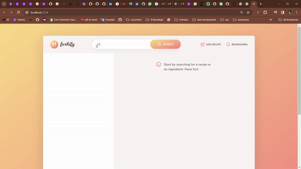

<h1 align="center">Forkify App</h1>
<p align="center">
    
 </p>


<h2 align="center">
Check out the <a href="https://forkify-app-for-recipes.netlify.app/" target="_blank">live Forkify App here</a>.
</h2>
<p align="left">
Forkify is a recipe search and saving app, built with HTML5, CSS3, and JavaScript. It features an intuitive user interface and dynamic serving size adjustment. The app uses advanced JavaScript concepts like asynchronous programming, ES6 modules, and object-oriented programming. Forkify was created by Jonas Smechmann in his Udemy course and this app was built as part of a personal project to learn JavaScript.
</p>

## Features

- Search for recipes: Find recipes using keywords or ingredients.
- View recipe details: See ingredients, cooking instructions, and serving size.
- Bookmark recipes: Save your favorite recipes for later.
- Add recipes: Create and share your own recipes.
- Pagination: Easily navigate search results.
- Responsive Design

## Built with

- JavaScript
- CSS3
- HTML5
- Parcel
- NPM

<p align="center">
  
</p>

## Flowchart

<p align="center">
  
</p>

## Recipe Loading Architecture

<p align="center">
  
</p>

## Installation

- Clone this repo:

```sh
git clone https://github.com/islam-solaiman/Forkify-Recipe-App.git
```

- Install dependencies:

```sh
npm install
```

- Run the app:

```sh
npm start
```

## Author

<b>👤 Islam Solaiman</b>

- LinkedIn - [@Islam Solaiman](https://www.linkedin.com/in/islam-solaiman/)
- Github: [@islam Solaiman](https://github.com/islam-solaiman)

Feel free to contact me with any questions or feedback!

## Credits

This app was created as part of [Jonas Smechmann](https://twitter.com/jonasschmedtman)'s Udemy course [The Complete JavaScript Course 2023: From Zero to Expert!](https://www.udemy.com/course/the-complete-javascript-course/).

Special thanks to Jonas for his excellent teaching and guidance throughout the course.

## Show your support

Give a ⭐️ if you liked this project!